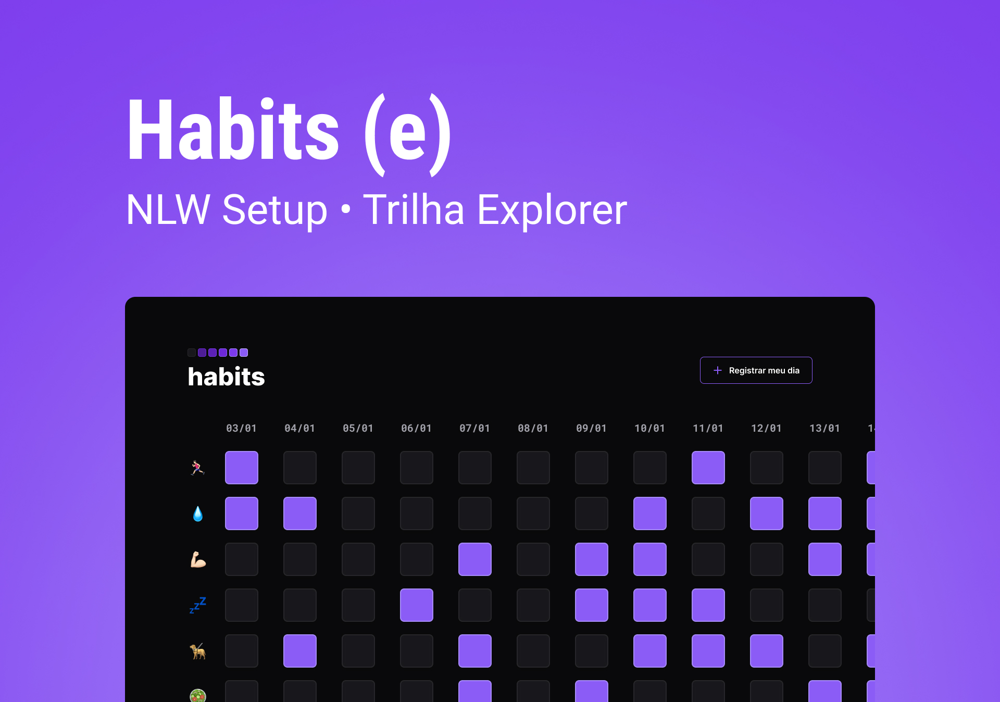
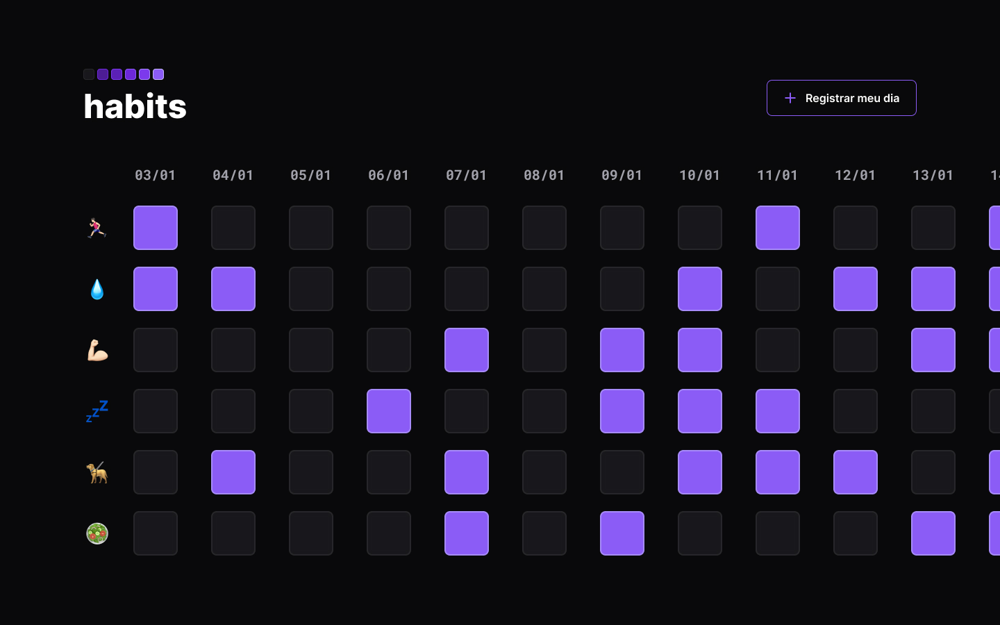

# ✅Habit Tracker!

  <a href="#-tecnologias">Tecnologias</a>&nbsp;&nbsp;&nbsp;|&nbsp;&nbsp;&nbsp;
  <a href="#-projeto">Projeto</a>&nbsp;&nbsp;&nbsp;|&nbsp;&nbsp;&nbsp;
  <a href="#memo-licença">Licença</a>
 

 
  
  

## 🚀 Tecnologias

Esse projeto foi desenvolvido com as seguintes tecnologias:

- HTML
- SCSS
- JavaScript

## 💻 Projeto

Habit Tracker e um app para usar como assistente de controle de hábitos estudando fundamentos da programação e tecnologias como HTML, CSS, JavaScript

## :memo: Licença

Esse projeto está sob a licença MIT. Veja o arquivo [LICENSE](LICENSE.md) para mais detalhes.

---

## Link para o visualizar o site finalizado.

<a href="">Site</a>
